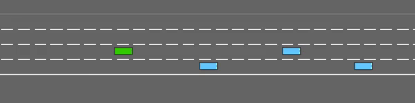
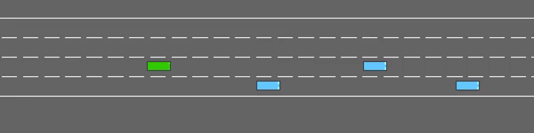
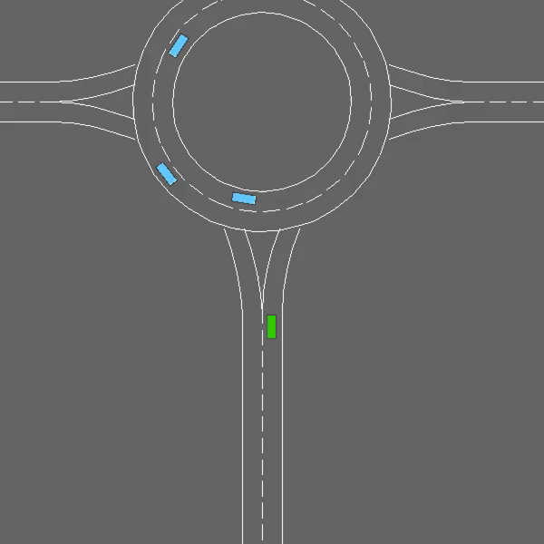
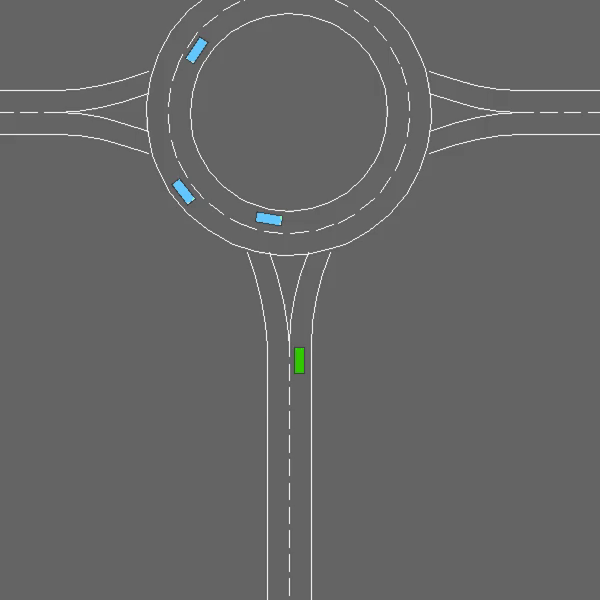

# Spiking Multi-Modal Deep Q-Network (MM-DQN)

This repository contains the official implementation of the paper:

**“A New Spiking Architecture for Multi-Modal Decision-Making in Autonomous Vehicles”**  
Submitted to **AAMAS 2026 (The 25th International Conference on Autonomous Agents and Multi-Agent Systems)**.

The framework introduces a multi-modal spiking deep Q-network that integrates BEV camera representations and LiDAR-derived occupancy maps using novel spiking cross-attention mechanisms.

---

## Table of Contents
- Overview
- Repository Structure
- Environments
- Architecture Variants
- Installation & Requirements
- Version Specifications
- Torch & CUDA Versions
- How to Run
- Results
- Citation
- License

---

# Overview

This repository includes two versions of the implementation:

1. **Submitted Code** — the exact version included during the conference submission (located in `/Submitted_Code`).  
2. **Modular Implementation** — a cleaner, extensible, and maintainable version intended as the long-term official release.

The project supports two gymnasium-based autonomous driving environments:
- **Multi-lane Highway**
- **Roundabout Navigation**

Both scenarios involve multi-agent interactions requiring fast temporal reasoning and multi-modal fusion.

---

# Repository Structure

```text
MM-DQN/
│
├── Submitted_Code/
│   ├── highway/
│   ├── roundabout/
│   └── ...
│
├── Modular_Code/
│   ├── models/
│   ├── utils/
│   ├── configs/
│   ├── train_test.py
│   └── ...
│
├── results/
│   ├── highway/
│   ├── roundabout/
│   └── ...
│
└── README.md
```

---

# Environments

### **1. Highway-v0**
A multi-lane, multi-agent driving environment requiring rapid decision-making and safe lane changes.

### **2. Roundabout-v0**
A more complex navigation scenario with multiple vehicles in circular traffic flow.

Both environments are part of the `highway_env` package.

---

# Architecture Variants

Three architectures are provided:

### **1. MM-DQN (Non-Spiking Baseline)**
Standard deep Q-network working on BEV and LiDAR pseudo-image inputs.

### **2. SSA — Standard Spiking Attention**
A binary spiking model with standard spike-based attention.

### **3. TTSA — Temporal-Aware Ternary Spiking Attention (Proposed)**
Main contribution of the paper, featuring:
- Temporal-aware ternary spikes  
- Improved spiking cross-attention  
- Higher representational capacity  
- More stable training and improved reward  

---

# Installation & Requirements

### **Python Version**
Python **3.9 – 3.11**

### **Install Dependencies**

```bash
pip install highway_env gymnasium snntorch numpy torch einops msgpack msgpack_numpy tensorboard
```

### **Optional (Recommended)**

```bash
pip install opencv-python matplotlib
```

---

# Version Specifications

The repository has been tested using the following versions:

| Package        | Version |
|----------------|---------|
| **torch**      | 2.7.1   |
| **CUDA** | 12.8 |
| **numpy**      | 2.2.6   |
| **snntorch**   | 0.9.4   |
| **gymnasium**  | 1.2.0   |
| **highway-env** | 1.10.1 |
| **einops**     | 0.8.1   |
| **tensorboard** | 2.20.0 |


---

# How to Run

```bash
python train_test.py     --seeds <number_of_seeds>     --mode <nonspiking | SSA | TTSA>     --scenario <highway-v0 | roundabout-v0>
```

### Examples

```bash
python train_test.py --seeds 5 --mode TTSA --scenario highway-v0
python train_test.py --seeds 3 --mode SSA --scenario roundabout-v0
```

---

# Results

## **Highway Scenario**

# Nonspiking
-

# Spiking with SSA
- 

# Spiking with TTSA
-

## **Roundabout Scenario**
# Nonspiking
-

# Spiking with SSA
- 

# Spiking with TTSA
- 

---

# Citation


---

# License

